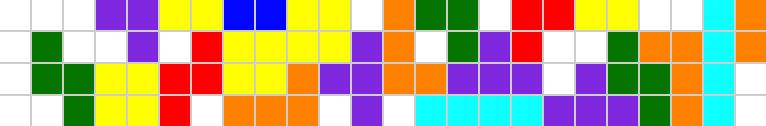
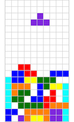
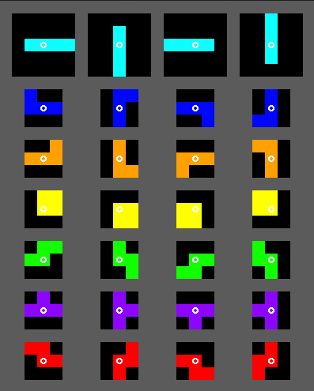
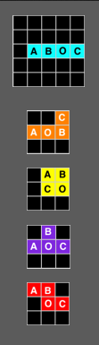
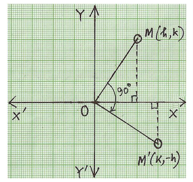
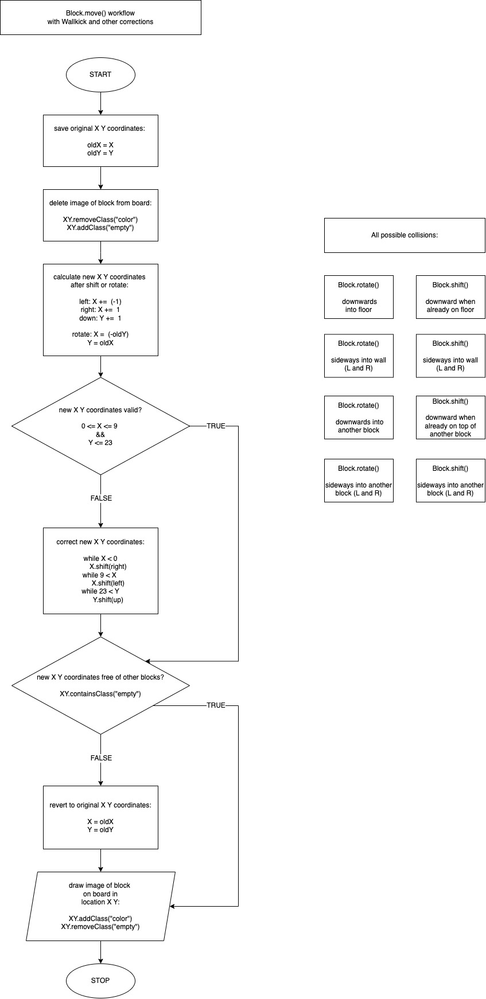

</img>

## General Assembly Project 1: Tetris

### Outline
<!-- START doctoc generated TOC please keep comment here to allow auto update -->
<!-- DON'T EDIT THIS SECTION, INSTEAD RE-RUN doctoc TO UPDATE -->

- [Description](#description)
- [Deployment link](#you-will-find-the-deployed-version-here-tetris)
- [Getting Started](#getting-started)
- [Timeframe & Working Team](#timeframe--working-team)
- [Technologies Used](#technologies-used)
- [Brief](#brief)
- [Planning](#planning)
- [Build/Code Process](#buildcode-process)
- [Challenges](#challenges)
- [Wins](#wins)
- [Key Learnings & Takeaways](#key-learnings--takeaways)
- [Bugs](#bugs)
- [Future Improvements](#future-improvements)

<!-- END doctoc generated TOC please keep comment here to allow auto update -->

## Description

</img>This was my very first project. It is an in-browser grid-based game written in JavaScript, HTML and CSS. I was excited about being able to create my own first browser game. 

12 years ago, one night a programmer friend emailed me a .swf file with the code for a Tetris game. He said he wanted me to test his new game he had just written because "all the tetris games he found online were just not quite right". I knew nothing about programming then and it blew my mind that you can write your own game like that. I was fascinated.

We lost touch over the years and Flash has become obsolete so .swf files don't run anymore. So as my first coding project I chose to re-create this tetris game to remember my friend.

### You will find the deployed version here: [Tetris](https://z-moz.github.io/basic-tetris-game/) 

### Getting Started

Left ⬅️ and right ➡️ arrow keys move the falling Tetromino left and right.

Up ⬆️  arrow key rotates the Tetromino clockwise.

Down ⬇️ arrow key accelerates the Tetromino downward.

### Timeframe & Working Team

A solo project completed in two weeks, part time.

### Technologies Used

* JavaScript (ES6)
* HTML5
* CSS3
* Git/GitHub
* app.diagrams.net (flowcharts)

### Brief

The aim was to design a game that:

* Renders in the browser.
* Has logic for winning & it displays when the player won.
* Includes separate HTML / CSS / JavaScript files.
* Follows KISS (Keep It Simple Stupid) and DRY (Don't Repeat Yourself) principles.
* Uses Javascript for DOM manipulation.
* Is deployed online.
* Uses semantic markup for HTML and CSS.

The aim of the tetris game:

* The player has to fit different shaped blocks (Tetrominoes) together so that they make a complete line across the playing board.
* Once a row is full it disappears from the game board. The remaining blocks move down, and a new row appears at the top.
* The player can move the Tetrominoes sideways and rotate them clockwise.
* The aim of the game is to get as many points as possible before the game board fills up with Tetrominoes.
* Some Tetrominoes can create issues when turning near the edges of the board or near other blocks. Make sure there are features that resolve this.

## Planning

I chose to work on a Tetris game because I was interested in the logic required and wanted to challenge myself. I started by reading the documentation at [Tetris encyclopaedia](https://tetris.wiki/) to get a good understanding of the game. I listed the necessary features and prioritised them based on their complexity and dependency on other features. Then I focused on figuring out the logic for the rotations and the collision corrections. As these are the backbone of the game and the most complex features it was important to get them right before working on anything else.

It seemed that a popular method was storing the coordinates of the blocks in matrices. This requires an array of matrices for each Tetrimino to store coordinates for all their orientations. The rotations would be done by iterating through these, and each Tetrimino would need its own correction functions, different for each separate case. I thought this was too much typing of not very different code blocks, although probably with decent readability. I wasn’t quite sure how the corrections would work with this method without a lot of potential for bugs.

I opted to use coordinate pairs and simple mathematical transformations. This requires far less code and it’s much simpler to manipulate. Also I thought it would be much more intuitive to use for the collision corrections.

I used the[ Guideline Super Rotation System](https://tetris.wiki/Super_Rotation_System#How_Guideline_SRS_Really_Works):

<div align="center">
</img><br>
<i>(source: <a href="https://strategywiki.org/wiki/Tetris/Rotation_systems">https://strategywiki.org/wiki/Tetris/Rotation_systems</a>)</i>
</div>
&nbsp;

Once I was fairly certain that my choice of logic was viable I came up with the step-by-step checklist for my MVP to implement in order: 

* The board: 
    * Create a grid.
* The blocks: 
    * Create a block class.
    * Add properties to render one block.
    * Add basic methods:
        * Rotating the blocks. 	 
        * Shifting sideways and down.
    * Add keyboard control to moving/rotating the blocks.
    * Add automatic methods:
        * Automatic falling.
        * Stop block falling or reacting to keyboard input when it hits the floor.
        * Correction when the block hits the wall/other blocks.
        * Generate a new block and trigger this function when the previous block stopped.
    * Add properties to render the rest of the blocks.
* Function to detect and delete full rows.
* Game starts automatically.
* Game stops when the top row is full.

## Build/Code Process

Key sections of the logic:

* Rendering the board.
* Rendering the Tetrominoes.
* Shifting/rotating.
* Automatic movement, player-directed movements and corrections.
* Checking for any full rows and deleting.
* Checking if top row is still empty.

#### Rendering the board:

The board is a grid of cells in 24 rows and 10 columns generated using two nested iterators. 

In the browser each cell is initialised with the class "empty", then added to the HTML file by JavaScript via DOM.

In the script each cell is an item in an array of arrays: inside an array called 'grid' 24 arrays with 10 items each. This way each cell would have x y coordinates: grid[row][column] or grid[y][x], which will make moving the Tetriminoes very simple later: 

```
const board = document.querySelector("#board");

const rows = 24;
const columns = 10;

// create grid
// order of coordinates: grid[y][x] or grid[row][column]
let grid = new Array(rows);
for (let i = 0; i < rows; i++) {
 grid[i] = new Array(columns);
 for (let j = 0; j < columns; j++) {
   const cell = document.createElement("div");
   cell.classList.add("empty");
   grid[i][j] = cell;
   board.append(cell);
 }
}
```

#### Rendering the Tetrominoes:

Each Tetromino is made of four cells where the class "empty" was toggled to a colour class. I named the cells A, B, C and O. O is the cell that the block will rotate about: 

<div align="center">
</img>
</div>
&nbsp;

I defined each cell by an x-y coordinate pair. This way each Tetromino block is defined by 8 numbers for the coordinates (Ax, Ay, Bx, By, Cx, Cy, Ox, Oy) and one colour. This array contains all the predefined coordinates used in this project: 

```
let arrayOfBlocks = [
 [4, 1, 6, 1, 7, 1, 5, 1, "aqua"],
 [4, 0, 4, 1, 6, 1, 5, 1, "blue"],
 [4, 1, 6, 1, 6, 0, 5, 1, "darkorange"],
 [4, 0, 4, 1, 5, 0, 5, 1, "yellow"],
 [4, 1, 5, 0, 6, 0, 5, 1, "green"],
 [4, 1, 5, 0, 6, 1, 5, 1, "blueviolet"],
 [4, 0, 5, 0, 6, 1, 5, 1, "red"],
];
```

#### Shifting/rotating:

I use a simple mathematical transformation here to shift the blocks sideways or down. The same single function is used for all three directions and for all the Tetriminos. The difference is adding/subtracting 1 from the x coordinates, or adding 1 to the y coordinates:

```
 // left: shiftXY(-1, 0), right: shiftXY(1, 0), down: shiftXY(0, 1)

 shiftXY(dx, dy) {
   this.Ax += dx;
   this.Bx += dx;
   this.Cx += dx;
   this.Ox += dx;
   this.Ay += dy;
   this.By += dy;
   this.Cy += dy;
   this.Oy += dy;
 }
```

The rotation is also very simple this way. Again a mathematical transformation to rotate the coordinates 90-degrees around the origin. 

To rotate clockwise: newX = oldY and newY = oldX * (-1): 

<div align="center">
</img><br>
<i>(90 degree clockwise rotation. Source:  <a href="https://www.math-only-math.com">https://www.math-only-math.com</a>)</i>
</div>
&nbsp;

A single rotation function for all the Tetriminos, from any starting orientation: 

```
 // clockwise: rotateXY(-1,1), anticlockwise: rotateXY(1,-1)

 rotateXY(dx, dy) {
   this.Ax = dx * (this.Ay - this.Oy) + this.Ox;
   this.Ay = dy * (oldAx - this.Ox) + this.Oy;
   this.Bx = dx * (this.By - this.Oy) + this.Ox;
   this.By = dy * (oldBx - this.Ox) + this.Oy;
   this.Cx = dx * (this.Cy - this.Oy) + this.Ox;
   this.Cy = dy * (oldCx - this.Ox) + this.Oy;
 }
```

I added an event listener to the Block class to monitor the arrow keys. I also added an event handler with a switch statement. It connects the shiftXY() function to the 'left', 'right' and 'down' keys, and the rotateXY() function to the 'up' key.

#### Automatic movement, player-directed movements and corrections:

The blocks have two different types of movement: automatic and player-directed.

Automatic movement - fall() function:

the continuous fall of the block towards the bottom of the board. The steps: a downward shift, a validation and a correction if needed. If the next downward step would make the Tetrimino clash it stops. The event listener is removed so the block becomes inactive. A function checks for any empty rows and deletes them. Another function checks if all cells in the top row are still empty. If yes, a new block is generated and the game carries on.

Player-directed movements - move() function:

the rotation and the sideways/downwards shifts initiated by the player. The steps: the function saves the current coordinates and deletes the block. Then moves or rotates the block's coordinates to its new position but doesn't render it yet. Next it checks that there is no clash with the edge of the board. If there is then it runs the wallKick() function: one of three while loops to move the block back onto the board:

```
 wallKickFloorKick() {
   while (this.Ax < 0 || this.Bx < 0 || this.Cx < 0 || this.Ox < 0) {
     this.shiftXY(1, 0);
   }
   while (this.Ax > 9 || this.Bx > 9 || this.Cx > 9 || this.Ox > 9) {
     this.shiftXY(-1, 0);
   }
   while (this.Ay > 23 || this.By > 23 || this.Cy > 23 || this.Oy > 23) {
     this.shiftXY(0, -1);
   }
 }
```

After this it checks that this new position doesn't clash with another block. If it does then it corrects the step by changing the new coordinates back to the original ones. At the end the block is rendered again.

I drew up a flowchart to clarify the order of steps of this algorithm for myself. I realised that the validation needs to be in two separate steps. First a check for clashes with the edge of the board and running the wallkick function if needed. Then a check for clashes with other blocks: 

<div align="center">
</img>
</div>
&nbsp;

The steps of the move() function:

```
 move(dx, dy, operation) {
   this.delete();
   this.storeOrigXY();
   switch (operation) {
     case "rotate":
       this.rotateXY(dx, dy);
       break;
     case "shift":
       this.shiftXY(dx, dy);
       break;
   }
   this.wallKickFloorKick();
   if (!this.isCellEmpty()) {
     this.returnOrigXY();
   }
   this.draw();
 }
```

#### Checking for any full rows and deleting:

The deleteFullRow() function iterates through each row. In each row it counts how many cells have an "empty" class. When it finds a row that has no empty cells it saves its index. The function uses the index number to delete the row from the script as well as the HTML. After this it adds a new row to the top. The row numbers are the indices of the elements of the grid, so the numbering will be automatically correct again.

#### Checking if top row still empty:

The function isTopRowEmpty() runs each time the fall() function ends. As long as it returns true a new Tetrimino is generated and the game carries on. When it returns false the timer interval is cleared to stop the game and a “GAME OVER” alert shows. The player can restart the game by refreshing the browser.

### Challenges

There were a lot more possible cases of collision than I had initially expected. Detecting and correcting all of them was a lot more involved than I would have thought.

### Wins

* The biggest win was increasing my understanding of JavaScript.
* I was pleased with the simplicity of using coordinates and mathematical transformations.
* I was able to create an MVP with minimal bugs at the first attempt.
* I'm happy that I was able to make a complex game as my first project.

## Key Learnings & Takeaways

* Working on this project was a good experience, it helped to solidify my understanding of JavaScript and how to do a whole project from start to finish. 
* My background is in science so I have a solid foundation in mathematics. In this project I used mathematical transformations for the logic of moving the blocks. This hugely simplified my code compared to what I saw in other Tetris projects on GitHub. This emphasised to me the importance of brushing up on my maths skills and to look out for ways to employ them in programming, it’s a very powerful tool. 
* I learned the importance of organising my work and refactoring my code as I go.
* I also recognized how necessary it is to keep my code easy to read: For very small projects I might keep everything in one file and use separators. But more often it will be much more complex and will be divided into separate modules.

## Bugs

* I spent a lot of time on making the collision detection work in all directions. This came at the cost of the game looking pretty basic for now.

## Future Improvements

* Use the SRS rule set for the rotations instead of the Guideline SRS. 
* Better design for the background, the grid and the whole page.
* Welcome text, instructions, a start/restart button.
* A point counter for each row completed.
* Upcoming blocks visible in the sidebar.
* Increasing difficulty levels with the blocks falling faster.
* A separate welcome page or alert, and a separate page or alert when levelling up.
* Playable on a touch screen and optimised for the size of a tablet and phone.